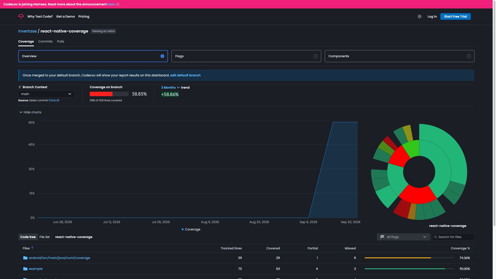
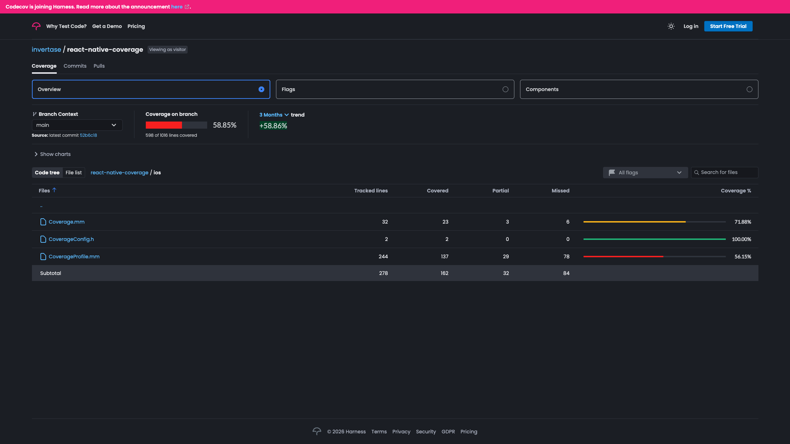
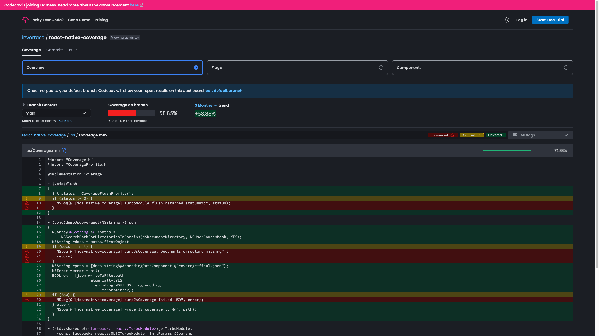

<p align="center">
  <a href="https://docs.page/invertase/react-native-coverage">
    
  </a>
</p>

<h1 align="center">Code coverage for React Native — Typescript, iOS, and Android — without touching the native stuff.</h1>

<p align="center">
  <a href="https://app.codecov.io/gh/invertase/react-native-coverage"></a>
  <a href="https://docs.page/invertase/react-native-coverage"></a>
  
  <a href="./LICENSE"></a>
</p>

<p align="center">
  Install it into a dedicated test / e2e harness app (<a href="https://docs.page/invertase/react-native-coverage/pattern-c">Pattern&nbsp;C</a>) — never your shipping app.
</p>

<p align="center">
  A TurboModule flushes real device coverage; the CLI pulls it, <strong>merges</strong> every framework's <code>.profraw</code> and the app binary into clean LCOV&nbsp;/&nbsp;Jacoco, and remaps your instrumented JS line-for-line back to TypeScript. Use that as a signal in your development loop or CI to gate development iterations or CI pass/fail.
</p>

<p align="center">
  <strong>Integrate with your favorite tools</strong> — for visibility, or as a workflow quality gate during development.
</p>

<p align="center">
  <a href="https://app.codecov.io/gh/invertase/react-native-coverage">
    
  </a>
</p>

---

## Why this exists

React Native is cross-platform, but your **coverage tooling stops at the JavaScript bundle**.

The Objective-C++, Swift, and Kotlin that make your TurboModules actually work? That code
runs on a device during your e2e suite and then vanishes without a trace. **iOS native
coverage in particular is a black box** — LLVM `.profraw` files buried in a simulator
container, `__llvm_profile` counters that never get flushed, dynamic frameworks that hide
their own LINKEDIT sections. Nobody wants to hand-wire that.

So teams don't. They ship native modules with a green checkmark that only ever proved the
JS ran. In an agentic world where a model can rewrite your `.mm` file and swear it's tested,
**that missing evidence is a real problem.** Coverage is the backpressure. It's how you — or
your agent — prove the native path executed, not just the mock.

`react-native-coverage` makes that evidence a one-liner: flush from the TurboModule, `rn-coverage pull`
to merge the scattered native counters and remap your JS back to TypeScript, then `rn-coverage assert`
to turn "did the native path actually run?" into a pass/fail signal for your dev loop or CI.

No Podfile regex. No profraw archaeology. No Gradle spelunking.

---

## Show, don't tell

This repository **proves its own thesis on Codecov, live on `main`** — including the hard part, iOS.

| Flag | What ran | Coverage |
|------|----------|---------:|
| [`e2e-ios-dynamic`](https://app.codecov.io/gh/invertase/react-native-coverage) | iOS native, dynamic frameworks (the hard case) | **90.6%** |
| [`e2e-android`](https://app.codecov.io/gh/invertase/react-native-coverage) | Android native (Emma → Jacoco) | **81.7%** |
| [`e2e-ios-static`](https://app.codecov.io/gh/invertase/react-native-coverage) | iOS native, static libraries | **63.1%** |
| [`unit-js`](https://app.codecov.io/gh/invertase/react-native-coverage) | Jest unit (JS/TS) | **52.6%** |

Those numbers come from an actual iOS Simulator and Android emulator running the harness apps
under Appium — not from a mock. Browse them yourself:

**The iOS native directory, with per-file line coverage** — [`ios/` on Codecov →](https://app.codecov.io/gh/invertase/react-native-coverage/tree/main/ios)

<p align="center">
  
</p>

**The TurboModule itself, line by line** — [`ios/Coverage.mm` on Codecov →](https://app.codecov.io/gh/invertase/react-native-coverage/blob/main/ios/Coverage.mm)
Real Objective-C++ (`flush()`, `dumpJsCoverage`, `getTurboModule`), green where a device
executed it, at **71.88%**:

<p align="center">
  
</p>

### The gap this closes

[**React Native Firebase**](https://github.com/invertase/react-native-firebase) — one of the
most-installed libraries in the ecosystem — already depends on `react-native-coverage` in its
dedicated `tests/` app. Its Android native coverage is
[live on Codecov](https://app.codecov.io/gh/invertase/react-native-firebase) at **65.9%** (the
`android-native` flag), while the `ios-native` flag still reads **`0.0%`** today. That remaining
zero — the hardest half — is exactly what this package exists to turn into a number.

---

## Used in production by

<p align="center">
  <a href="https://github.com/invertase/react-native-firebase">
    
  </a>
  &nbsp;&nbsp;&nbsp;&nbsp;&nbsp;&nbsp;
  <a href="https://github.com/invertase/react-native-google-mobile-ads">
    
  </a>
</p>

Both [**React Native Firebase**](https://github.com/invertase/react-native-firebase) and
[**React Native Google Mobile Ads**](https://github.com/invertase/react-native-google-mobile-ads)
flush real device coverage through the `react-native-coverage` TurboModule from their dedicated
[Pattern C](https://docs.page/invertase/react-native-coverage/pattern-c) test apps — the same
pattern this README describes.

---

## Have your agent wire it up

Paste this into your coding agent (Cursor, Claude, Codex, …) **before** you touch Gradle or
Podfiles by hand:

```text
Integrate react-native-coverage into this repo's dedicated React Native test /
e2e harness app only (Pattern C — never the production app package.json).

Constraints:
- New Architecture / TurboModule only
- Follow https://docs.page/invertase/react-native-coverage
- Prefer the Expo config plugin when the harness is Expo; otherwise use the bare
  Gradle + CocoaPods Ruby helpers from the integration docs
- Wire libraryProjectMatchers / frameworkNamePrefixes for every native library
  we need hits from
- Add CI steps that pull coverage and fail with rn-coverage assert (exit 2)
  when hits are empty
- Do not invent product-app install paths; keep the package out of the shipping app

After install: yarn/npm add react-native-coverage in the harness, apply the plugin or
manual hooks, prebuild / pod install as needed, then show me the exact CI commands
to run and what green looks like.
```

---

## Install

Install in the **harness** (your dedicated test/e2e app), never the product app:

```sh
yarn add react-native-coverage
# or: npm install react-native-coverage
```

### Expo (recommended)

Add the config plugin, then prebuild:

```json
{
  "expo": {
    "plugins": [
      [
        "react-native-coverage",
        {
          "libraryProjectMatchers": ["my-native-lib"],
          "frameworkNamePrefixes": ["MyLib"],
          "enableAndroidCoverage": true,
          "forceDynamicFrameworks": false
        }
      ]
    ]
  }
}
```

```sh
npx expo prebuild
```

### Bare React Native

Apply the shipped `android/rn-coverage*.gradle` helpers and the
`cocoapods/coverage_post_install.rb` Ruby helper as documented in
[Android](https://docs.page/invertase/react-native-coverage/integration/android) and
[iOS](https://docs.page/invertase/react-native-coverage/integration/ios). Copy
`react-native-coverage.config.js.example` if you need host-specific paths.

---

## Prove it in CI

Run your e2e suite, call `Coverage.flush()` at teardown, then:

```sh
# Android
rn-coverage android pull && rn-coverage android report

# iOS
rn-coverage ios pull && rn-coverage ios export && rn-coverage ios report

# The point: empty hits must fail the job
rn-coverage assert   # exit 2 when coverage is empty
```

`rn-coverage assert` is the package-owned replacement for one-off "did anything get covered?"
shell scripts. Wire it into CI and a sabotaged or silently-broken pipeline fails loudly.
Full CLI surface: [docs → CLI](https://docs.page/invertase/react-native-coverage/cli).

---

## What you get

| Piece | Role |
|-------|------|
| **TurboModule** | `flush()` — iOS LINKEDIT LLVM flush + Android Emma dump from the running app (also dumps Istanbul `global.__coverage__` when present) |
| **CLI (`rn-coverage`)** | `android pull\|report`, `ios pull\|export\|report\|summary`, `js pull\|report`, `assert` |
| **Expo config plugin** | Wires the Gradle helpers + the Podfile helper call (safe split) |
| **CocoaPods Ruby helper** | Pod LLVM flags + optional dynamic-framework restore |
| **Gradle Jacoco helpers** | `android/rn-coverage.gradle` + `android/rn-coverage-jacoco.gradle` |
| **JS/TS coverage** | `babel-plugin-istanbul` + NYC source-map remap → TypeScript-accurate LCOV |

---

## Documentation

Full docs live at **[docs.page/invertase/react-native-coverage](https://docs.page/invertase/react-native-coverage)**:

- [Why native coverage](https://docs.page/invertase/react-native-coverage/why) — the problem, in full
- [Pattern C](https://docs.page/invertase/react-native-coverage/pattern-c) — dedicated test apps only
- **App developers:** [Expo & RN CLI integration](https://docs.page/invertase/react-native-coverage/app-developers)
- **Library maintainers:** [unit tests + test app](https://docs.page/invertase/react-native-coverage/library-maintainers)
- **Agents:** [quick-wire guide](https://docs.page/invertase/react-native-coverage/agents)
- Reference: [CLI](https://docs.page/invertase/react-native-coverage/cli) · [Config](https://docs.page/invertase/react-native-coverage/config)

---

## Example / CI cells

This repo's `example/` (Expo) and `example-dynamic/` (bare RN, dynamic frameworks) are the
harness. **Appium** (WebDriverIO) drives them on every PR:

| Cell | Path | Proves |
|------|------|--------|
| iOS **dynamic** (primary) | `example-dynamic/` | Non-zero LCOV with a real dynamic `CoverageFixture.framework` |
| iOS **static** | `example/` | Expo staticlib merge; fixture hits still asserted |
| Android | `example/` | Emma `.ec` → Jacoco → assert |

```sh
yarn
yarn prepare
yarn test          # or: yarn test:coverage
yarn e2e:ios:dynamic
yarn e2e:ios:static
yarn e2e:android
node bin/rn-coverage.js --help
```

---

## Releasing

Conventional Commits + semantic-release, **manual `workflow_dispatch` only** (no
push-to-main publish). Operator steps:
[docs → Releasing](https://docs.page/invertase/react-native-coverage/releasing).

## License

Apache-2.0 — see [LICENSE](./LICENSE).

<p align="center">
  <br/>
  <a href="https://invertase.io">
    
  </a>
  <br/>
  <sub>Built and maintained by <a href="https://invertase.io">Invertase</a>.</sub>
</p>
